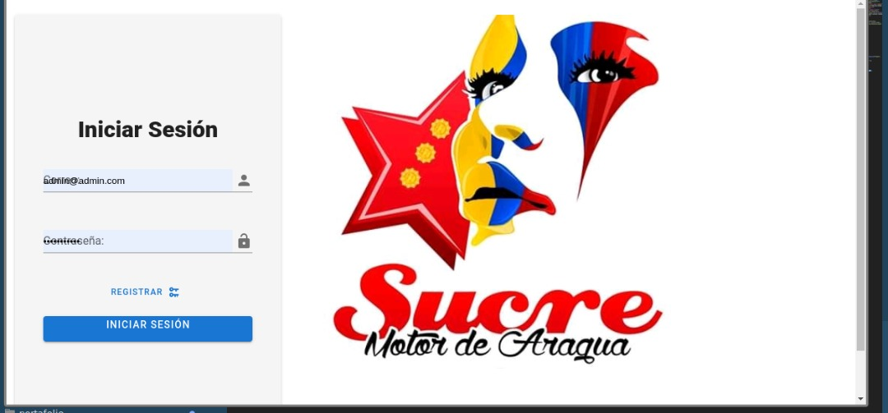

<h1 style="text-align: center;">Sistema de equipos de la alcaldia del estado Aragua</h1>

Se trata de una sistema de registro para los equipos de la alcaldia del estado Aragua

	<h2>Instalación</h2>
<ul>
	<li>git clone https://github.com/vilo0812/alcaldia-aragua-sucre-project.git</li>
	<li>sudo chmod -R 777 alcaldia-aragua-sucre-project</li>
	<li>cd alcaldia-aragua-sucre-project/api/</li>
	<li>composer install</li>
	<li>cp .env.example .env</li>
	<li>php artisan key:generate</li>
	<li>composer update</li>
	<li>php artisan cache:clear && php artisan config:cache && php artisan config:clear</li>
	<li>composer require tymon/jwt-auth</li>
	<li>php artisan jwt:secret</li>
	<li>Desde la consola (usando MySql) podrías hacer algo similar a esto 
	mysql -u root -psecret</li>
	<li>CREATE DATABASE tu_base_de_datos;</li>
	<li>Posteriormente debes agregar las credenciales al archivo .env 
	DB_HOST=localhost 
	DB_DATABASE=tu_base_de_datos 
	DB_USERNAME=root 
	DB_PASSWORD=tu-contraseña</li>
	<li>php artisan migrate --seed</li>
	<li>php artisan serve</li>
	<li>en la carpeta spa</li>
	<li>yarn install</li>
	<li>yarn serve</li>
</ul>

	

		puedes ingresar al sistema con el siguiente usuario:
	

	<ul>
		<li>
			correo: gabriel.viloria0812@gmail.com
		</li>
		<li>
			clave: 1234
		</li>
	</ul>

<small style="text-align: center;">
	Ministerio Del Poder Popular Para la Educación 
	Alcaldia Del estado Aragua 
	2020-2021
</small>
